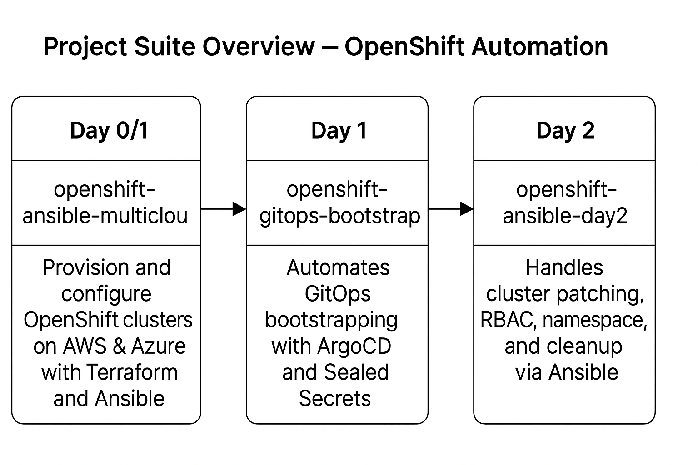

## Project Suite Overview – OpenShift Automation

This project is part of a 3-repo suite that demonstrates automation across the full OpenShift cluster lifecycle in multi-cloud environments using Ansible and Terraform:

| Phase         | Project & Repo Name                             | Description                                                                 |
|---------------|--------------------------------------------------|-----------------------------------------------------------------------------|
| **Day 0/1**   | [openshift-ansible-multicloud](https://github.com/siluvai1997/openshift-ansible-multicloud) | Provision and configure OpenShift clusters on AWS & Azure with Terraform and Ansible |
| **Day 1**     | [openshift-gitops-bootstrap](https://github.com/siluvai1997/openshift-gitops-bootstrap)     | Automates GitOps bootstrapping with ArgoCD and Sealed Secrets              |
| **Day 2**     | `openshift-ansible-day2` *(this repo)*           | Handles cluster patching, RBAC, namespaces, and cleanup via Ansible         |

Together, these repositories demonstrate how to automate OpenShift installation, platform bootstrapping, and production-grade Day-2 operations using industry best practices.

Ideal for consulting engagements where OpenShift platform enablement, repeatability, and multi-cloud strategy matter.


# OpenShift Day-2 Operations with Ansible

This project automates critical Day-2 OpenShift operations such as patching, user/namespace management, RBAC policies, and cleanup tasks. It uses Ansible to provide a repeatable, auditable way to manage post-install lifecycle operations.

## Features

- OpenShift cluster patching automation
- Namespace and user creation with RBAC
- Network policies for workload isolation
- Cleanup of unused persistent volumes
- Easily extendable Ansible roles

## Prerequisites

- Access to an OpenShift cluster with `oc` CLI configured
- Ansible installed (`pip install ansible`)
- `kubernetes.core` collection: 
  ```bash
  ansible-galaxy collection install kubernetes.core
  ```

## Usage

Run any of the day-2 operations:

### 1. Patch OpenShift Cluster

```bash
ansible-playbook playbooks/upgrade-cluster.yml
```

### 2. Manage Namespaces

```bash
ansible-playbook playbooks/manage-namespaces.yml
```

### 3. Apply RBAC Policies

```bash
ansible-playbook playbooks/apply-rbac.yml
```

### 4. Cleanup Unused PVCs

```bash
ansible-playbook playbooks/cleanup-pvcs.yml
```

## Testing the Project

To test safely:
- Run playbooks in `--check` or `--diff` mode
- Start with `upgrade-cluster.yml` which only logs patch intent (simulation mode)
- You can create a dummy namespace and see if it’s modified by `manage-namespaces.yml`

## Repo Structure

```
.
├── playbooks/
│   ├── upgrade-cluster.yml
│   ├── manage-namespaces.yml
│   ├── apply-rbac.yml
│   └── cleanup-pvcs.yml
├── roles/
│   ├── patching/
│   ├── namespace/
│   ├── rbac/
│   └── cleanup/
└── README.md
```

## High-Level Project Workflow 

